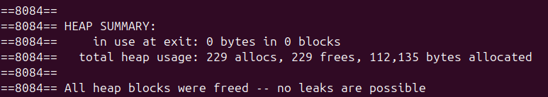

# Description
This custom-made library holds various functions to help you keep a registry of all your allocations.
- Free all allocated memory with one function call from anywhere
- No need for NULL checks after allocating
- No risks of double free
- Use xfree() to free any data type and everything it points to
- Easily add custom structs and data types
- No global variables used (using static variable as a get-around)

<i>ℹ️ Allocations that were not made using functions of the library are not kept in the registry</i>

## Functions in the library

### Allocating memory:

#### xmalloc(size_t nmemb, t_reg_type type)

-> Allocates NMEMB elements of XTYPE. Stores it in a registry of all xallocs. Initializes registry if it isn't already.

#### xcalloc(size_t nmemb, t_reg_type type)

-> Allocates NMEMB elements of XTYPE. Sets all bytes to 0. Stores entry in a registry of all xallocs. Initializes registry if it isn't already.

<i>ℹ️ If allocation fails, registry is destroyed, and program exits with exit code MEMERRORCODE</i>

### Freeing memory:

#### xfree(void *address)
-> Searches the alloc registry for the entry. Frees its address and any subaddress available. For example, if you pass char **, frees with free_arr(). arrays must be NULL-ed.

#### xfree_ptr(void *address)
-> Frees the address and deletes it from the registry. Does not free anything else.

<i>ℹ️ If the address is not found in the registry nothing gets freed (preventing errors)</i>

### Other

#### xfree_registry(void)

-> Frees whole registry and destroys it

#### xexit(int status)
-> Destroys registry and exits with status
